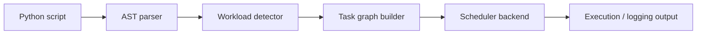
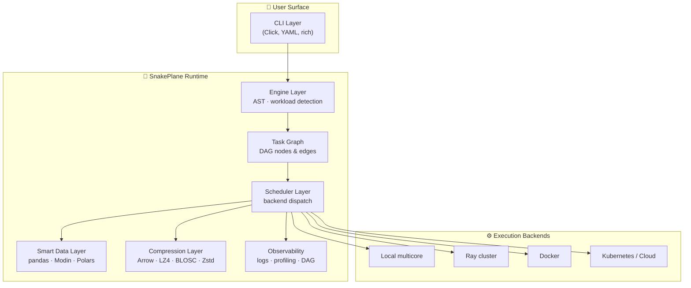
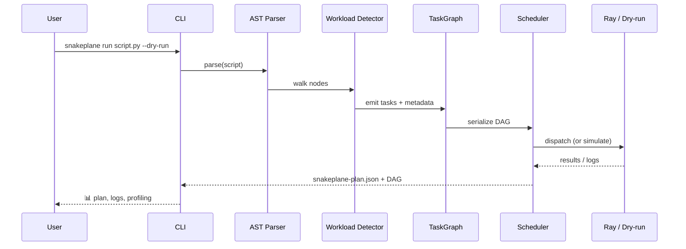
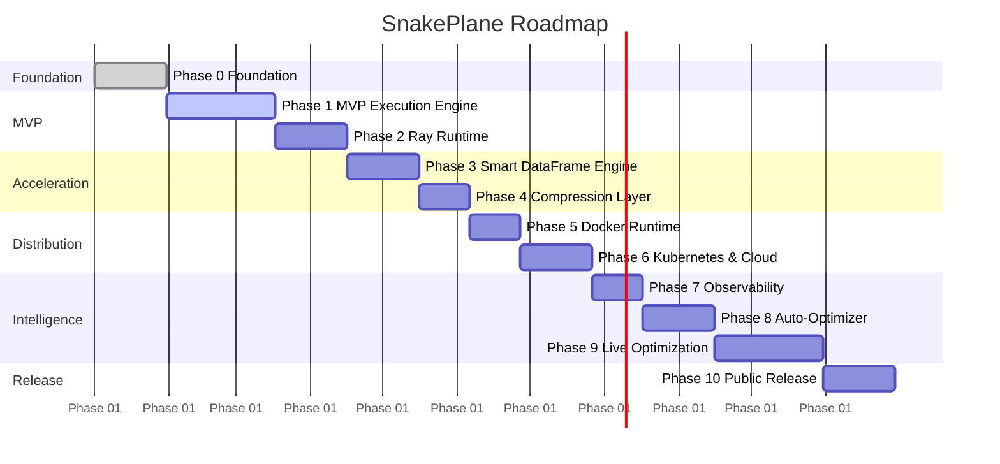
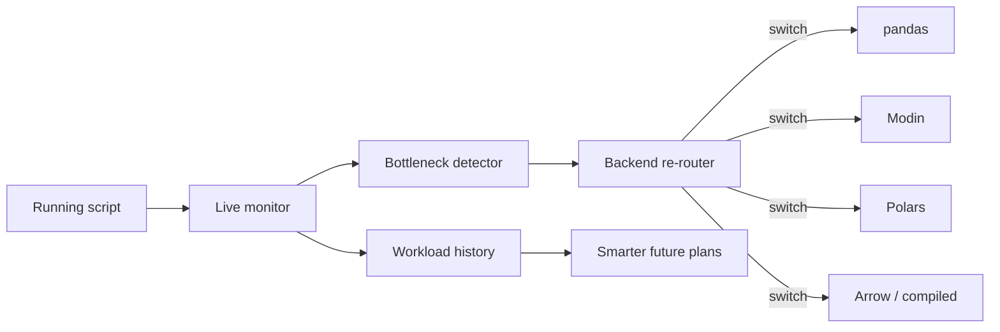

# 🐍 SnakePlane

> **A Python-native distributed execution layer that turns ordinary scripts into scalable workloads — no rewrites required.**

[]() []() []() []() []()

SnakePlane analyzes Python code, detects expensive data and compute patterns, builds an execution DAG, and routes work through scalable backends such as **Ray**, **Docker**, **Kubernetes**, and future dataframe/runtime engines.

> **Mission:** Make distributed execution feel native to Python — no rewrites, no setup hell, no infrastructure ceremony.

---

## 📑 Table of Contents

1. [Why SnakePlane](#-why-snakeplane)
2. [What It Does](#-what-it-does)
3. [Core Philosophy](#-core-philosophy)
4. [Quick Start](#-quick-start)
5. [Architecture](#-architecture)
6. [Repository Structure](#-repository-structure)
7. [Roadmap](#-roadmap)
8. [Release Milestones](#-release-milestones)
9. [MVP Success Criteria](#-mvp-success-criteria)
10. [Tech Stack](#-tech-stack)
11. [Out of Scope (MVP)](#-out-of-scope-for-the-mvp)
12. [Documentation & Planning](#-documentation--planning)
13. [Contributing](#-contributing)
14. [License](#-license)

---

## 💡 Why SnakePlane

| Traditional Approach | SnakePlane |
|---|---|
| Rewrite pandas → Spark / Dask APIs | Keep your pandas, NumPy, vanilla Python |
| Manage cluster YAML, drivers, executors | Auto-route to local / Ray / Docker / K8s |
| Choose a backend up front | Backend selected from detected workload |
| Performance tuning is manual | Optimizer learns from run history (Phase 8+) |
| Distributed compute = ceremony | Distributed compute = a CLI flag |

---

## 🚀 What It Does

SnakePlane lets developers run familiar Python, pandas, NumPy, and data-processing scripts through an intelligent execution plane. Instead of forcing rewrites for Spark, Dask, Ray, or Kubernetes, it:

- 🧠 **Parses** ordinary Python scripts via AST
- 🔎 **Detects** dataframe-heavy and compute-heavy operations
- 🕸️ **Builds** a task graph automatically
- 🎯 **Selects** an execution backend
- 💾 **Optimizes** memory and intermediate data movement
- 🖥️ **Runs** locally, in containers, or on cluster infrastructure
- 📊 **Surfaces** clear logs, plans, profiling, and DAG visibility

---

## 🧭 Core Philosophy

SnakePlane is **not** a traditional operating system. It is a lightweight runtime plane for Python workloads.

Where a normal OS schedules a Python process on one machine, SnakePlane sits *above* the Python runtime and decides how the work should be split, optimized, routed, compressed, and executed.

The long-term goal is a Python execution layer that behaves like an **autopilot**:

- ✅ No code changes for the user
- ✅ Automatic scaling across local cores, containers, or clusters
- ✅ Transparent acceleration through Modin, Polars, Arrow, Ray, and future runtimes
- ✅ Observable execution through plans, logs, profiling, metrics, and DAG views
- ✅ Future live optimization based on runtime behavior

---

## ⚡ Quick Start

### 1. Install dependencies

```bash
pip install -r requirements.txt
```

### 2. Run a sample script

```bash
python -m cli.main examples/simple_etl.py --dry-run
```

…or once packaged as a CLI:

```bash
snakeplane run examples/simple_etl.py --dry-run
```

### 3. Expected execution flow



### 4. Sample output

```text
Detected DataFrame load at line 5
Detected apply() inside for loop at line 14

Planned DAG:
    LoadCSV → Clean → Apply → GroupBy → Export

Backend:  Ray
Dry Run:  Enabled
```

---

## 🏗️ Architecture

### High-level layered view



### MVP execution path



### Component responsibilities

| Component | Responsibility |
|---|---|
| **CLI Layer** | Runs scripts, accepts flags, prints execution output |
| **Engine Layer** | Parses Python AST and detects expensive operations |
| **Task Graph** | Represents detected work as DAG nodes and edges |
| **Scheduler Layer** | Dispatches or simulates tasks through the selected backend |
| **Smart Data Layer** | Routes dataframe work through pandas-compatible acceleration paths |
| **Compression Layer** | Handles Arrow / LZ4 / BLOSC-style intermediate frame storage |
| **Observability Layer** | Emits logs, execution plans, profiling data, future DAG views |

---

## 📁 Repository Structure

```text
snakeplane/
├── cli/             # CLI entrypoints and command handling
├── core/            # Backends, scheduler interface, runtime orchestration
├── engine/          # AST parsing, workload detection, DAG creation
├── compression/     # In-memory compression and frame IO
├── data/            # Future smart dataframe / data layer
├── infra/           # Future Docker / Kubernetes / cloud runtime adapters
├── examples/        # Sample scripts
├── docs/            # Architecture and roadmap documentation
├── tests/           # Unit and integration tests
└── snakeplane-plan.json
```

---

## 🗺️ Roadmap

### Phase summary

| Phase | Focus | Deliverable | Status |
|---|---|---|---|
| **0** | Foundation & project setup | Repo, scope, tooling, automation | ✅ Mostly complete |
| **1** | MVP execution engine | Dry-run plan from a real script | 🟡 In progress |
| **2** | Ray runtime & scheduler backend | Real distributed task execution | ⬜ Not started |
| **3** | Smart DataFrame engine | Transparent pandas/Modin/Polars routing | ⬜ Not started |
| **4** | Compression & intermediate storage | Arrow + BLOSC/LZ4/Zstd toggles | ⬜ Not started |
| **5** | Docker runtime & local orchestration | Identical local + container UX | ⬜ Not started |
| **6** | Kubernetes & cloud scaling | Cluster-backed execution profiles | ⬜ Not started |
| **7** | Observability, debugging & DAG viz | Profiling + DAG inspection tools | ⬜ Not started |
| **8** | Auto-optimizer | Backend & partitioning recommendations | ⬜ Not started |
| **9** | Live optimization layer | Adaptive routing during execution | ⬜ Not started |
| **10** | Public release & ecosystem | Stable v1.0 + docs + benchmarks | ⬜ Not started |

### Roadmap visualization



---

### Phase 0 — Foundation & Project Setup ✅

> **Goal:** Establish the repository, architecture, tooling, and MVP scope.

| Workstream | Status |
|---|---|
| Initialize GitHub repository | ✅ |
| Initial folder structure | ✅ |
| Define MVP architecture | ✅ |
| Decide MVP scheduler direction | ✅ |
| Decide compression format direction | ✅ |
| Documentation skeleton | ✅ |
| Freeze MVP scope | ✅ |
| GitHub issue automation | ✅ |

---

### Phase 1 — MVP Execution Engine 🟡

> **Goal:** Allow a user to run a normal Python script and generate a scalable execution plan.

**Expected outcome**

```bash
python -m cli.main examples/simple_etl.py --dry-run
```

A developer sees a planned execution graph **without changing the original script**.

**Task status (from Notion export)**

| Status | Items |
|---|---|
| ✅ **Done** | Repo init, config schema, config loader, architecture docs, MVP scope, tooling decisions, GitHub issue automation |
| 🟡 **In progress** | CLI entrypoint |
| ⬜ **Not started** | Runner, AST walker, dispatch pattern detection, task graph, scheduler interface, Ray mock backend, compression wrapper, JSON DAG output, visualizer, example script, tests, docs |

**Detected pattern targets**

- Loops over rows / records
- `.apply()`, `.groupby()`, `.agg()`
- DataFrame loads (`read_csv`, `read_parquet`)
- File IO with measurable size
- AST nodes labeled with line number, op type, estimated workload size

---

### Phase 2 — Ray Runtime & Scheduler Backend ⬜

> **Goal:** Move from dry-run planning to real distributed task execution.

**Workstream**

- Design the `SchedulerBackend` interface
- Implement Ray backend support
- Add backend selector in config and CLI
- Map task graph nodes to scheduler tasks
- Support local multicore execution
- Improve task-level logs
- Add failure handling and backend fallback

**Why Ray for the MVP**

| Candidate | Outcome |
|---|---|
| **Ray** ⭐ | Tight Python integration, works with Modin, low setup overhead — chosen for MVP |
| Dask | Strong dataframe story, but more ecosystem overhead for an early MVP |
| Fugue | Higher-level abstraction; revisit later as a wrapper, not a base |

---

### Phase 3 — Smart DataFrame Engine ⬜

> **Goal:** Add transparent dataframe acceleration.

- Pandas-compatible dataframe routing
- Evaluate **Modin** (Ray backend) and **Polars**
- CSV + Parquet inputs
- Arrow-backed memory layout where useful
- Benchmark pandas vs Modin vs Polars paths

---

### Phase 4 — Compression & Intermediate Storage ⬜

> **Goal:** Improve memory efficiency and data movement between tasks.

- Compression format toggle
- `store_frame()` / `load_frame()` helpers
- Arrow + LZ4 / BLOSC storage
- Zstd evaluation for high-ratio batch jobs
- Local disk / tmpfs / future object-storage backends
- Compression/decompression timing logs

**Default strategy**

| Mode | Stack |
|---|---|
| **Default** | Apache Arrow + BLOSC + LZ4 |
| **High-ratio** | Apache Arrow + BLOSC + Zstd |
| **Fallback** | No compression, or raw LZ4 for special cases |

---

### Phase 5 — Docker Runtime & Local Orchestration ⬜

> **Goal:** Make SnakePlane portable across local and containerized environments.

- Docker runtime adapter
- Packaged runtime image
- Local vs Docker execution modes
- CLI/config flags for execution mode
- Container structure prepared for K8s
- Consistent dev environments

---

### Phase 6 — Kubernetes & Cloud Scaling ⬜

> **Goal:** Expand from local/container execution to cluster-backed execution.

- Kubernetes-native execution
- Ray-on-Kubernetes patterns
- Autoscaling configuration
- Cloud runner hooks (e.g., ECS)
- Local / Docker / cluster / cloud execution profiles
- Remote intermediate storage strategy

---

### Phase 7 — Observability, Debugging & DAG Visualization ⬜

> **Goal:** Make SnakePlane easier to inspect, trust, and debug.

- Richer CLI logging
- Local CPU/memory profiling
- Task-level timing
- DAG JSON output + text-mode visualizer
- Lightweight web/notebook DAG view
- Monitoring/debug panel for MVP workflows

---

### Phase 8 — Auto-Optimizer ⬜

> **Goal:** Turn SnakePlane into a performance-aware runtime.

- Runtime trace collection
- CPU / IO / memory bottleneck classification
- Backend recommendations
- Partitioning recommendations
- Config-driven optimization controls
- Speculative execution & adaptive batching prep
- Live optimization & feedback loop prep

---

### Phase 9 — Live Optimization Layer ⬜

> **Goal:** Add dynamic runtime intelligence that adapts execution while code runs.



---

### Phase 10 — Public Release & Ecosystem ⬜

> **Goal:** Package SnakePlane into a stable, documented, public developer tool.

- Installable package
- Expanded user + dev docs
- Benchmark results
- Examples and tutorials
- Contributing guide
- Release roadmap finalization
- Public launch materials
- Stable cloud hooks

---

## 🏷️ Release Milestones

| Version | Focus | Highlights |
|---|---|---|
| **v0.1** | Local script scaling | AST → DAG → Ray dry run |
| **v0.2** | Docker + CLI integration | Containerized execution |
| **v0.3** | Kubernetes support | Cluster-backed runs |
| **v0.5** | Auto-optimizer | Config-driven tuning |
| **v1.0** | Stable public release | Docs, benchmarks, cloud hooks |

---

## 🎯 MVP Success Criteria

The MVP is successful when **all** of the following are true:

- [ ] A user can install SnakePlane and run a normal Python script
- [ ] The script can be analyzed without user code changes
- [ ] Dataframe and compute-heavy operations are detected
- [ ] A DAG can be generated and printed
- [ ] A scheduler backend can simulate or execute the plan
- [ ] Intermediate frame compression can be toggled
- [ ] CSV and Parquet inputs are supported
- [ ] Basic logs, profiling, and debug output are available
- [ ] The workflow is documented with examples

---

## 🧰 Tech Stack

| Area | Tech |
|---|---|
| **Distributed Compute** | Ray (multiprocessing fallback) |
| **DataFrames** | Modin, optional Polars, pandas-compatible routing |
| **Format & Compression** | Apache Arrow, LZ4, BLOSC, optional Zstd |
| **Task Scheduling** | Ray or custom micro-scheduler |
| **Containerization** | Docker, Kubernetes-ready build |
| **CLI & Config** | Click, YAML, psutil, rich |
| **Logging** | loguru, rich console, future web logs |

---

## 🚫 Out of Scope for the MVP

These are roadmap items, **not** initial MVP requirements:

- Full Kubernetes deployment manager
- Real-time Kubernetes autoscaling
- PyPy / Numba / JIT-level optimization
- User-facing extensibility SDK
- Workflow DAG orchestration UI
- Notebook or GUI interface
- Multi-user support or authentication
- SQL or streaming source support

---

## 📚 Documentation & Planning

| Resource | Link |
|---|---|
| 📓 Roadmap / Notion | [NEUROSPECT workspace](https://www.notion.so/NEUROSPECT-221126fae7f480eab2baed5857405d93) |
| 📐 MVP Architecture | `docs/architecture.md` |
| 🧪 Notion Export | User docs, project docs, benchmarks, release strategy, setup notes, tech evaluations |
| 📋 Linear | *Not linked yet — no Linear URL or issue key was found in the exported Notion docs* |

> If a Linear project or issue URL is added later, link it here:
> `Linear: https://linear.app/<workspace>/project/<project-id>`

---

## 🤝 Contributing

Contributions are welcome.

### Branch naming convention

| Type | Pattern |
|---|---|
| Feature | `feature/yourname/issue-123-short-description` |
| Bugfix | `bugfix/yourname/issue-123-short-description` |
| Hotfix | `hotfix/yourname/issue-123-short-description` |

---

## 📜 License

MIT License — see [`LICENSE`](LICENSE).

---

<sub>🐍 SnakePlane · Distributed execution that feels native to Python.</sub>
